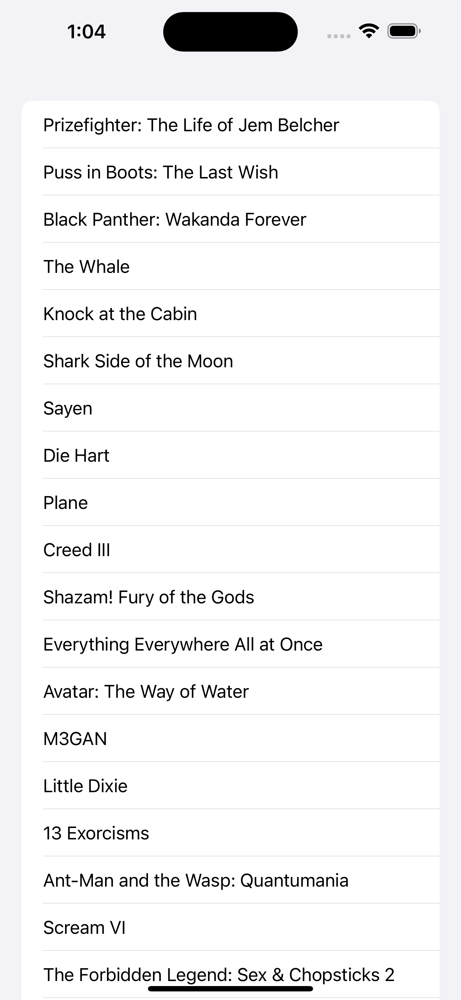
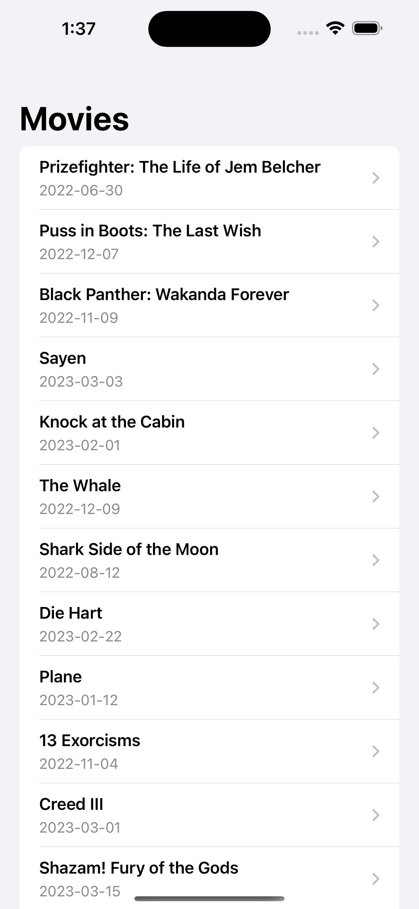
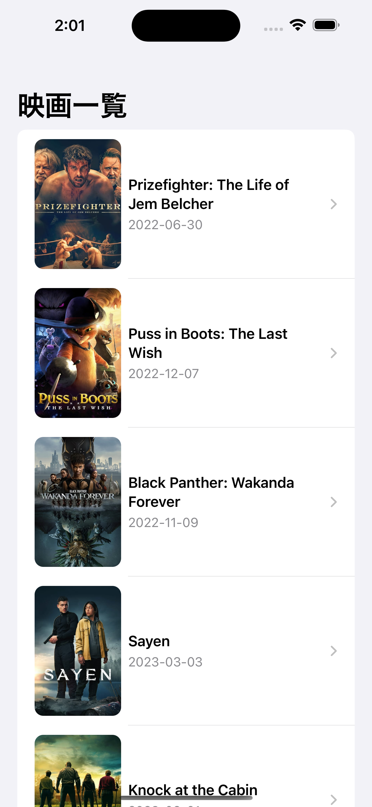

🙂「私に毎日新しい映画５本を推薦してくれて、どこで見れば良いかもわかるiPhoneアプリ作って」

🤖「ハイ、ショウチシマシタ。」

# UI

## 初期

<kbd>

</kbd>

## 中期

| list | detail |
| --- | --- |
|||

動画

<kbd>

</kbd>

## 後期

| list | detail |
| --- | --- |
|||

## Notionに書いてたメモ

アプリ名は良いと思った

ReactNative → Swift, SwiftUIが良さそうという判断にプログラマの知識が必要（別にReact Nativeでも良いけど）

プロジェクトは自分で作る必要がある。

TMDb APIキーなどの知識は必要。

どのディレクトリにファイルを生成する必要があるは考える必要がある。

Xcodeの操作方法は知っておく必要がある。（プロジェクト作成、ファイル作成など）

ビルドなどの用語は知ってる必要がある（質問できないから）

何も表示されない時に本来であればAPIキー取得や、host、path、jsonの構造などを確認するがChatGPTだと提案されたコードを試しては失敗してまた提案されたコードに置き換えてみたいに、原因にたどり着くのに時間がかかりそう。

>ビルドは通りますが表示されません。
>TMDb APIキーを取得する必要があるのではないでしょうか。

APIキー取得とドキュメント読みたくなってきた

アカウントは作ってくれない。

TMDBは日本語対応してた笑

APIキーの読み込み方を教えてくれたのは少し感動。

TMDB_API_KEYみたいな変数名も提案してくれるのもエネルギー節約になって良い気がする。

普通にAPIキーをplistから読み込めて感動。

感動を伝えたら受け答えしてくれてそれに対してまた感動してしまった。

リストから詳細へ遷移できた。少し感動。。。

Terminalは必要

Git＆GitHubは必要

gitignore(gibo)は必要

hub create -p